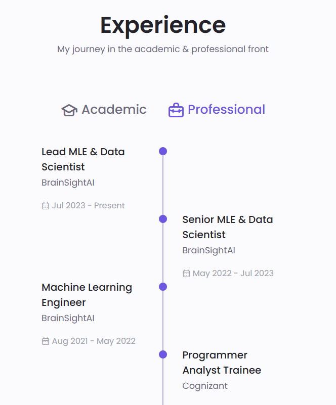

Hello! I'm a proficient Data Engineer with extensive expertise in Azure and ETL processes. With a solid background in designing and optimizing ETL processes, I leverage Azure Databricks for advanced data transformation and Azure Data Factory to orchestrate data pipelines seamlessly. My experience includes managing CI/CD processes through DevOps and Git, ensuring seamless integration and deployment of data solutions. I specialize in creating scalable, secure, and efficient data architectures that meet the dynamic needs of businesses.

But here's the catch: beyond my experience lies a curiosity-driven expertise that extends to the realms of machine learning and AI. I've spearheaded research and projects specializing in computer vision and robotics. Though they're not part of my current gig, I'm itching to blend them into my journey. My diverse background enables me to approach problems from unique perspectives, driving innovation and value.

Eager to connect and explore roles that leverage my data engineering expertise while incorporating my interests in machine learning and AI. Let's collaborate and drive success through cutting-edge technology and data-driven solutions.

# Work Experience

 
 
 
  

    <!-- Job 1 -->
    

      

<!--         
 -->
      <!-- Company Logo -->
     
   
      <h3 style="color: black; margin-top: 0;">Position at Company 1</h3>
      
Years of Experience: X years

      
Short description of your role and responsibilities at Company 1. Highlight key achievements and skills gained.

    

     
 

    <!-- Job 2 -->
    

      

      <h3 style="color: black; margin-top: 0;">Position at Company 2</h3>
      
Years of Experience: Y years

      
Short description of your role and responsibilities at Company 2. Highlight key achievements and skills gained.

    

# Work Experience

  <!-- Job 1 -->
  

    

      
1

      

        <h3 style="color: black; margin: 0;">Position at Company 1</h3>
        
Years of Experience: X years

      

    

    
Short description of your role and responsibilities at Company 1. Highlight key achievements and skills gained.

  

  <!-- Job 2 -->
  

    

      
2

      

        <h3 style="color: black; margin: 0;">Position at Company 2</h3>
        
Years of Experience: Y years

      

    

    
Short description of your role and responsibilities at Company 2. Highlight key achievements and skills gained.

  

<!--  
#create an image

  
  

-->
# Experience

**My journey in the academic & professional front**

---

  <!-- Timeline Container -->
  

    
    <!-- Lead MLE & Data Scientist -->
    

      

      <h3 style="color: black; margin: 0;">Lead MLE & Data Scientist</h3>
      
BrainSightAI | Jul 2023 - Present

      
Description of your role and achievements.

    

    <!-- Senior MLE & Data Scientist -->
    

      

      <h3 style="color: black; margin: 0;">Senior MLE & Data Scientist</h3>
      
BrainSightAI | May 2022 - Jul 2023

      
Description of your role and achievements.

    

    <!-- Machine Learning Engineer -->
    

      

      <h3 style="color: black; margin: 0;">Machine Learning Engineer</h3>
      
BrainSightAI | Aug 2021 - May 2022

      
Description of your role and achievements.

    

    <!-- Programmer Analyst Trainee -->
    

      

      <h3 style="color: black; margin: 0;">Programmer Analyst Trainee</h3>
      
Company Name | Start Date - End Date

      
Description of your role and achievements.

    

  

# Experience
*My journey in the academic & professional front*

##Cognizant
XP: 3 yrs
-Data Engineer
  Aug 2022 - Present · 2 yrs 6 mos
  Kochi, Kerala, India 
  Authored pyspark notebooks for migrating from Informatica to Azure Cloud, focusing on Azure Databricks to enhance data processing and transformation. Leveraged Azure Data Factory (ADF) to orchestrate efficient, high-performance data pipelines.

Played a key role in developing a framework for seamless integration of services to the cloud, including batch processing, logging, data ingestion, distribution, utilities, and transformations using custom modules.Authored pyspark notebooks for migrating from Informatica to Azure Cloud, focusing on Azure Databricks to enhance data processing and transformation. Leveraged Azure Data Factory (ADF) to orchestrate efficient, high-performance data pipelines. Played a key role in developing a framework for seamless integration of services to the cloud, including batch processing, logging, data ingestion, distribution, utilities, and transformations using custom modules.…see more
Extract, Transform, Load (ETL) and Azure Databricks

-Big Data Analytics Intern
  Internship
  Feb 2022 - Jul 2022 · 6 mosFeb 2022 to Jul 2022 · 6 mos
  Bengaluru, Karnataka, IndiaBengaluru, Karnataka, India
  Gained knowledge and hands-on experience in Big Data frameworks by working extensively with Hadoop and Apache Spark, focusing on large-scale data processing and analysis.Gained knowledge and hands-on experience in Big Data frameworks by working extensively with Hadoop and Apache Spark, focusing on large-scale data processing and analysis.
Extract, Transform, Load (ETL)

# Experience

  
Lead MLE & Data Scientist</h3>
    
BrainSightAI

    
Jul 2023 - Present

  

  
  

    

    <h3 style="margin: 0; color: #4a4a4a;">Senior MLE & Data Scientist</h3>
    
BrainSightAI

    
May 2022 - Jul 2023

  

  
  

    

    <h3 style="margin: 0; color: #4a4a4a;">Machine Learning Engineer</h3>
    
BrainSightAI

    
Aug 2021 - May 2022

  

  
  

    

    <h3 style="margin: 0; color: #4a4a4a;">Programmer Analyst Trainee</h3>
    
Cognizant

    
May 2020 - Aug 2021

  

  

# Experience Timeline

  <!-- Timeline container -->
  

    <!-- Experience item -->
    

      

      
Lead MLE & Data Scientist

      
BrainSightAI

      
July 2023 - Present

    

    <!-- Experience item -->
    

      

      
Senior MLE & Data Scientist

      
BrainSightAI

      
May 2022 - July 2023

    

    <!-- Experience item -->
    

      

      
Machine Learning Engineer

      
BrainSightAI

      
August 2021 - May 2022

    

    <!-- Experience item -->
    

      

      
Programmer Analyst Trainee

      
Cognizant

      
June 2020 - August 2021

    

  

# Experience

**My journey in the academic & professional front**

---

  <!-- Timeline Container -->
  

    
    <!-- Lead MLE & Data Scientist -->
    

    

      <h2 style="color: black; margin: 0;">Data Engineer</h2>
      

        
<h3 style="color: darkgrey; margin: 0;">Cognizant</h3>

                 Jan 2022 - Present

      

      
Played a key role in developing a framework for seamless integration of services to the cloud, including batch processing, logging, data ingestion, distribution, utilities, and transformations using custom modules.Authored pyspark notebooks for migrating from Informatica to Azure Cloud, focusing on Azure Databricks to enhance data processing and transformation. Leveraged Azure Data Factory (ADF) to orchestrate efficient, high-performance data pipelines. Played a key role in developing a framework for seamless integration of services to the cloud, including batch processing, logging, data ingestion, distribution, utilities, and transformations using custom modules.…see more
Extract, Transform, Load (ETL) and Azure Databricks

    

    <!-- Senior MLE & Data Scientist -->
    

      

      <h3 style="color: black; margin: 0;">Senior MLE & Data Scientist</h3>
      

        
        
Inventeron Technologies | May 2022 - Jul 2023

      

      
Description of your role and achievements.

    

    <!-- Machine Learning Engineer -->
    

      

      <h3 style="color: black; margin: 0;">Machine Learning Engineer</h3>
      

        
        
BrainSight
<!--
# Skills

  

    
Python

    

      

    

  

  

    
SQL

    

      

    

  

  

    
Azure Databricks

    

      

    

  

  

    
Azure Data Factory

    

      

    

  

  

    
Machine Learning

    

      

    

  

# Skills

  

    
Python

    

      

    

  

  

    
SQL

    

      

    

  

  

    
Azure Databricks

    

      

    

  

  

    
Azure Data Factory

    

      

    

  

  

    
Machine Learning

    

      

    

  

-->

# Skills

  

    
Python

    

      

    

  

  

    
SQL

    

      

    

  

  

    
Azure Databricks

    

      

    

  

  

    
Azure Data Factory

    

      

    

  

  

    
Machine Learning

    

      

    

  

# Skills

  

    
Python

    

      

    

  

  

    
SQL

    

      

    

  

  

    
Azure Databricks

    

      

    

  

  

    
Azure Data Factory

    

      

    

  

  

    
Machine Learning

    

      

    

  

## Professional

### Lead MLE & Data Scientist
**BrainSightAI**  
*Jul 2023 - Present*

---

### Senior MLE & Data Scientist
**BrainSightAI**  
*May 2022 - Jul 2023*

---

### Machine Learning Engineer
**BrainSightAI**  
*Aug 2021 - May 2022*

---

### Programmer Analyst Trainee
**Cognizant**  
*May 2020 - Aug 2021*

